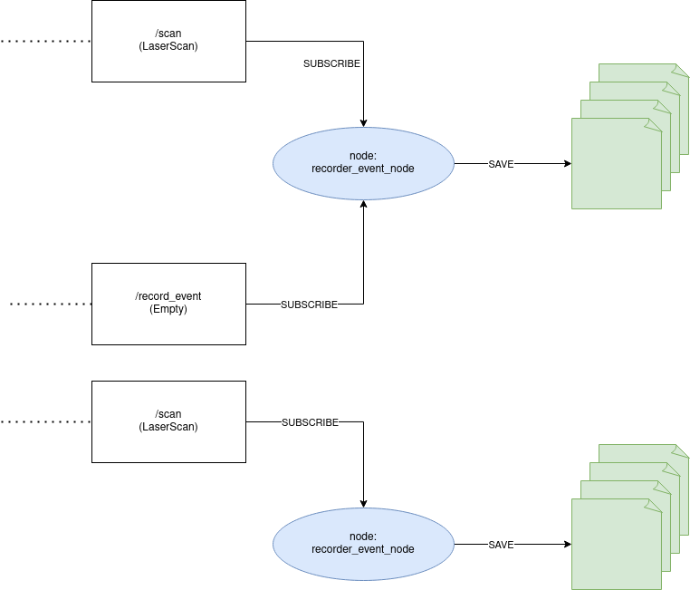

# ros_lidar_recorder 
Create csv file from LaserScan data.

## Architecture

The package **ros_lidar_recorder** is composed of: 
- 2 nodes: 
  - **recorder_auto_node**: record data with frequency 
  - **recorder_event_node**: wait event (message) for recording 
- 1 lib: 
  - **recorder**

the librarie recorder manages 3 classes: 
- **Recorder**: abstract class 
- **RecorderAuto** 
- **RecorderEvent**





## Use it 

(don't forget to compile the package)

### Use record_auto_node

```
rosrun ros_lidar_recorder recorder_auto_node _freq:={freq_hz} _path:={path_dir_data} 
```

by default the default path is **ros_lidar_recorded/data/**

### Use record_event_node

```
rosrun ros_lidar_recorder record_event_node _path:={path_dir_data} 
```

by default the default path is **ros_lidar_recorded/data/**
